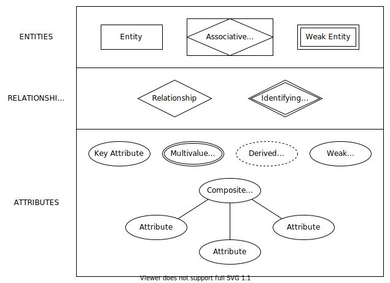

# [Database Fundalmentals](../../README.md)
## 2. Entities and Attributes

- [Database Fundalmentals](#database-fundalmentals)
  - [2. Entities and Attributes](#2-entities-and-attributes)
    - [ER Model](#er-model)
    - [Entity](#entity)
    - [Attributes](#attributes)
    - [Relationships](#relationships)
      - [Cardinality](#cardinality)
    - [Physical Diagram](#physical-diagram)

### ER Model

Entities and attributes can be represented in a [ER Model](https://en.wikipedia.org/wiki/Entity–relationship_model).

TOOLS to draw ER-Model:

1. MS Visio
2. draw.io - [Integration with VSCode](https://www.youtube.com/watch?v=AdrFG7sq1d4).

### Entity

An **[entity](https://en.wiktionary.org/wiki/entity)** may be defined as a thing capable of an independent existence that can be uniquely identified [2].

**Weak entity:** A weak entity, cannot exist without a strong (or normal) entity. For example, A company may store the information of dependents (Parents, Children, Spouse) of an Employee. But the dependents don’t have existence without the employee [3].

### Attributes

Attributes are the properties which define the entity type [3].

1. Key attribute: The attribute which **uniquely identifies each entity** in the entity set is called key attribute.
2. Composite attribute: Attributes with sub-attributes.
3. Multivalues attribute: An attribute consisting **more than one value** for a given entity. For example, Phone_No (can be more than one for a given person).
4. Derived attribute: An attribute which can be **derived from other attributes** of the entity type is known as derived attribute. e.g.; Age (can be derived from DOB - Date of birth).

### Relationships

A relationship captures how entities are related to one another [2].

Relationships are defined by verbs. For example, "has": A "laptop" entity has multiple "hard disk" entities.

#### Cardinality

The **number of times an entity of an entity set participates in a relationship** set is known as cardinality. Cardinality can be of different types:

**1. One to one –** When each entity in each entity set can take part **only once in the relationship**, the cardinality is one to one. Let us assume that a male can marry to one female and a female can marry to one male. So the relationship will be one to one.

In this example, each person has it's own certificate.

**2. Many to one –** When entities in one entity set **can take part only once in the relationship set and entities in other entity set can take part more than once in the relationship set,** cardinality is many to one. Let us assume that a student can take only one course but one course can be taken by many students. So the cardinality will be n to 1. It means that for one course there can be n students but for one student, there will be only one course.

In this example, `Person_1` has 2 cars (`Car_1` and `Car_2`) and `Person_2` has one car (`Car_3`).

**3. Many to many –** When entities in all entity sets can **take part more than once in the relationship** cardinality is many to many. Let us assume that a student can take more than one course and one course can be taken by many students. So the relationship will be many to many.

In this example, `Student_2` is enrolled in every course and `Course_1` has every student enrolled.

The example entity type **Laptops** with its attributes can be represented as:

### Physical Diagram

This kind of diagram is derived from ER-Diagrams but includes some more information like the datatype of every attribute.